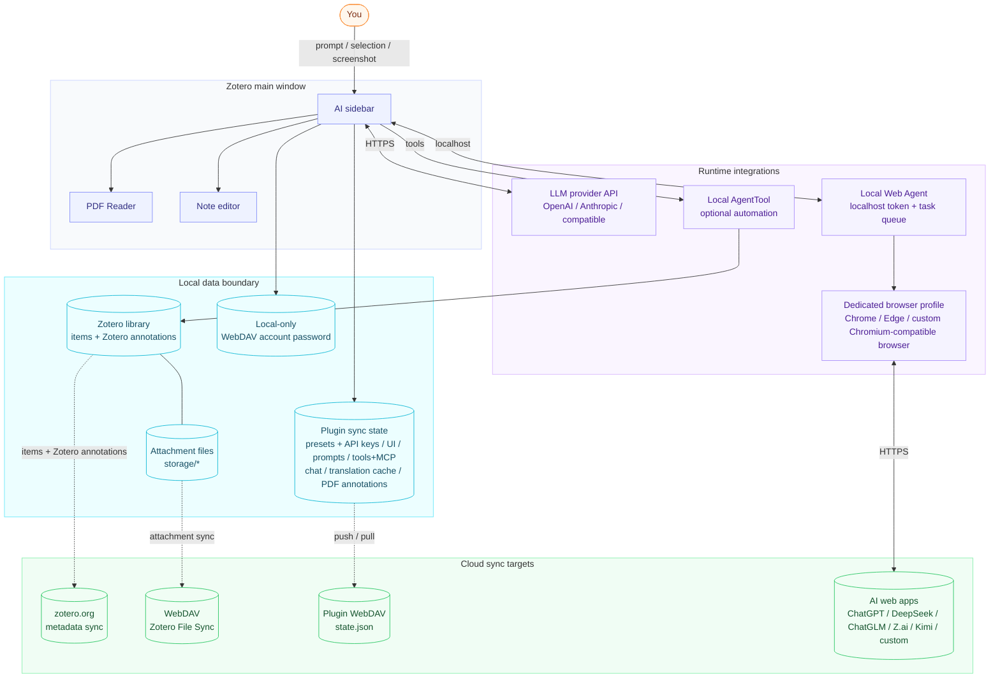
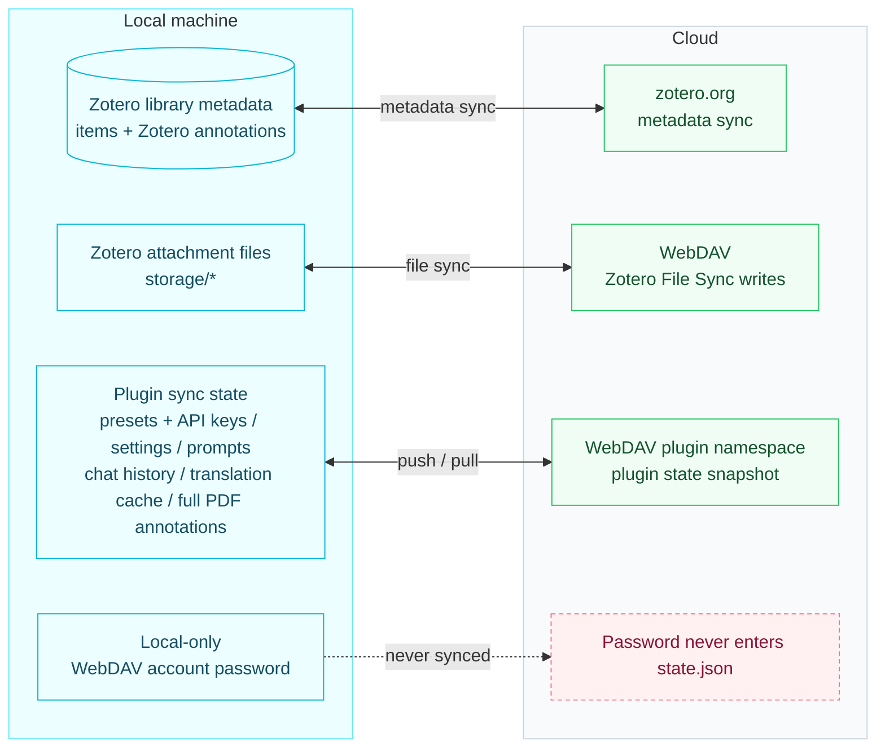

# Zotero AI Sidebar

[English](README.md) | [中文](README.zh-CN.md)

An AI research assistant that lives inside Zotero. Ask about the paper you're reading; the sidebar reads its PDF (or the arXiv LaTeX source when available), shows its work, and writes back to your notes.

> 👀 **[Illustrated usage guide →](https://xuhan-rgb.github.io/zotero-ai-sidebar/quick-start.html)** (pure-HTML diagrams following the current UI structure: overview · model config · chat · Quick Ask · immersive/full translation · notes & overview · shortcuts)

📖 [Full usage guide](docs/USAGE.md) ([中文](docs/USAGE.zh-CN.md)) — quick start, workflows, reference, and troubleshooting.

## What you can do with it

- **Ask anything about the paper you're reading** — *"summarize this"*, *"what's the core contribution"*, *"compare with X"*. The model fetches the parts of the PDF it needs and shows its work in a tool trace.
- **Choose API or WEB for each conversation** — use configured API presets directly, or mirror ChatGPT, DeepSeek, ChatGLM, Z.ai, Kimi, and custom ChatGPT-like sites through a local Web Agent. WEB mode keeps the website's current model/search/thinking state, reports staged progress, and incrementally mirrors the growing answer into Zotero.
- **Open Quick Ask anywhere and keep following up** — press `Alt+Q` by default for a temporary conversation that remembers turns while the window stays open, is destroyed on close, and can be explicitly transferred into the current paper's research chat.
- **See the whole paper at a glance** — generate a *全文总览* map: a phase-grouped section skeleton (motivation / method / validation) with one-line gists, innovation / result markers, and a structural flowchart. Click a section to jump to that spot in the PDF; your reading position is remembered per paper and synced across machines.
- **arXiv papers come through clean** — equations and figures are pulled from the LaTeX source instead of broken PDF text. *"Explain Eq. (3)"* and *"walk me through Figure 2"* actually work.
- **Ask with the paper's own material** — type `@` to list the paper's pictures, tables, and formulas, starting with the page you are reading (本页 / 全部 / 图片 / 表格 / 公式). Click 素材 (default `Ctrl+Shift+M`) to pick them straight on the PDF instead. A picked picture is sent as an image; a table or formula stays a short `[表 #1]` marker in the composer and expands to its LaTeX source on send.
- **Immersive PDF translation** — turn on immersive mode, click a sentence to get a translation card in place; walk the paper with `Enter` / `Shift+Enter`, `/` jumps the cursor into the ask box, and `Esc` closes the card while keeping the sentence on the reading highlight.
- **Write back into Zotero** — append answers to the paper's note, or ask the model to add color-coded highlights to the PDF (gated by per-preset permission).
- **Bring your own model** — Anthropic, OpenAI, or any OpenAI-compatible endpoint; all configured locally in Zotero preferences.
- **Local-first, and you own the sync target** — nothing leaves this machine until you turn on WebDAV sync, which pushes a single `state.json` to *your own* endpoint. It carries settings, model presets (API keys included), chat history, PDF annotations, and translation cache — never to zotero.org or any third party.

## Install

1. Download the latest `zotero-ai-sidebar.xpi` from [GitHub Releases](https://github.com/xuhan-rgb/zotero-ai-sidebar/releases/latest).
2. Open Zotero 7, 8, 9, or 10.
3. Go to `Tools` -> `Plugins`.
4. Click the gear icon and choose `Install Plugin From File...`.
5. Select the downloaded `.xpi` file and restart Zotero if prompted.

Installed plugins also update automatically: each release publishes `update.json` / `update-beta.json` to a fixed `release` Release, which the plugin's `update_url` checks, so both stable and preview installs are offered new versions in-place.

### What's new in v0.8.12

- **`@` picks the paper's material**: typing `@` in the composer lists the paper's pictures, tables, and formulas. For a MinerU-parsed PDF — including the PDF opened next to a LaTeX paper — material on the page you are reading is listed first and marked 本页, and the chips at the top switch between 本页 / 全部 / 图片 / 表格 / 公式. A picked picture is sent as an image; a picked table or formula stays a short `[表 #1]` marker in the composer and expands to its LaTeX source when you send.
- **`@` works for LaTeX-only papers**: arXiv figure files that are PDF or EPS are rasterised into pictures on the fly, and `\input` / `\include` files are expanded first, so papers whose sections live in separate `.tex` files no longer show an empty list.
- **WEB images are really uploaded**: pictures attached in the composer, including the ones picked with `@`, now travel with the message instead of being silently dropped.
- **Pick on the PDF, not just in the list**: the 素材 chip left of the composer arms click-to-pick (the default `Ctrl+Shift+M` does the same) — click a picture, table, or formula on the page to attach it, pick the same kind again to stack, and a green dashed box marks the current round's references. The page's text is locked while picking, so prose cannot be grabbed into a quote by accident; closing the list with the chip or `Esc` also deletes the half-typed `@`.
- **Straight answers about pages and sources**: material pages are resolved from the page text the reader prints (第 N–M 页·推测 when only the neighbours bound them), a list opened before that text is ready says so and is never cached, and on a LaTeX-only paper a click on the PDF points back to the list instead of pretending there is nothing to pick.
- **A usage notice**: the low-contrast 使用须知 chip right of 原文 in the input row now opens with where the paper's material comes from (LaTeX source / MinerU parse / neither yet) and how material is used (`@` list, picking on the PDF, `[表 #1]` markers, definite pages vs 推测 ranges), then what differs between API and WEB mode — above all that WEB sends no figures by default — and records the 素材 shortcut (default `Ctrl+Shift+M`). The paper card no longer repeats that warning.
- **Upgrade**: install the 0.8.12 XPI and restart Zotero. Existing settings, prompt edits, and WEB logins are kept.

Older release notes: see [CHANGELOG.md](CHANGELOG.md).

## Configuration

Open the AI Sidebar settings in Zotero and configure at least one model preset:

- Provider: `anthropic` or `openai`
- API key: stored locally in Zotero preferences
- Base URL: official endpoint or an OpenAI-compatible endpoint
- Model: any model ID supported by that endpoint
- Max tokens / tool iterations: local safety and output controls

Configure PDF translation in the **Immersive reading** section:

- Default translation model — immersive reading always uses this account, model, and reasoning effort; arXiv full-document translation inherits it on first use, then remembers its own selection from the translation toolbar
- Result position (above or below) / card size — controls the immersive translation card
- Neighbour context: send the previous and next sentence as context for a more accurate translation
- Key-term linking: highlight original ↔ translated key-term pairs, cross-lit on hover
- Shortcuts: next/prev sentence (default `Enter` / `Shift+Enter`), a selection quick-translate key (default Space), a focus-ask key (default `/`), and a collapse-toolbar key (default `h`), all remappable

Quick Ask opens with `Alt+Q` by default. It initially uses the active AI-chat model, then independently remembers the account, model, and reasoning effort selected inside Quick Ask; changing it does not modify the research chat or translation defaults.

Do not hardcode personal API keys, base URLs, or private model IDs in this repository.

### Optional WEB mode (Windows / Linux / macOS)

WEB mode uses a local companion process and a dedicated browser profile. Chrome and Microsoft Edge are detected automatically; other Chromium-compatible browsers can be configured by executable path. API mode does not need these components and is unaffected if the Web Agent is not installed.

> The Z.ai, automatic port allocation, and login detection flows below apply to `v0.8.9`. When upgrading, install the new XPI and follow the account dialog to install or update its paired Web Agent ZIP.

Requirements: Node.js 20 or newer and a browser supported by the Web Agent (automatically detected Chrome / Edge, or a compatible custom browser). Linux additionally needs `xclip`:

```bash
sudo apt install xclip
```

**Choose and configure a browser**

Open the small arrow next to **Account** (`账号 ▾`). The website selector chooses the AI service; the account menu chooses which browser runs it. The main **Account** button still opens the selected website directly in the saved browser. The account dialog also provides a browser-selection entry.

- **Chrome / Edge**: choose a browser from the native dropdown. The program-path field displays the detected or saved executable path. Choosing an option keeps the configuration menu open; click **Apply browser selection** (`应用浏览器选择`) to save.
- **Custom installation path**: edit the complete executable path or use **Choose program file…** (`选择程序文件…`). Select the browser executable, not a document or shortcut: `chrome.exe` / `msedge.exe` on Windows, the browser launcher on Linux, or the executable inside the app's `Contents/MacOS/` directory on macOS.
- **Recover a mistaken path**: for Chrome or Edge, click **Detect again** (`重新检测`). This ignores the saved path and searches the normal installation locations and PATH. Review the result, then apply it; detection alone does not save or launch the browser.
- **Add another browser**: choose **＋ Add another browser…** (`＋ 添加其他浏览器…`), enter a name, select its executable, and click **Save and use** (`保存并使用`). The saved entry appears in the dropdown. Custom browsers must support the existing Chromium remote-debugging connection; saving a path does not verify compatibility or add support for another browser engine.

Click outside the configuration menu to dismiss it without applying changes. Browser choice is shared by all WEB services and does not affect API mode. Each browser entry has a separate login profile; switching back reuses it. Running or queued WEB tasks must finish before switching browsers. Existing Chrome configurations are preserved; a fresh setup with only Edge detected selects Edge automatically.

After installing the XPI, select `WEB` in the composer, choose ChatGPT, DeepSeek, ChatGLM, Z.ai, Kimi, or a custom service, and click **Account**. The dialog checks the environment automatically. Missing Node.js or browser dependencies include official download buttons, while a missing Linux `xclip` dependency includes copyable installation guidance; the plugin never runs an installer or system command. Once the environment is ready, **Install**, **Repair**, or **Upgrade Web Agent** downloads the matching prebuilt runtime from the same GitHub Release, verifies its size and SHA-256, and opens the login page only after its health check passes. The user's computer never runs npm. If automatic download fails, the dialog provides the Release page, direct link, and a picker for the downloaded ZIP. Sign in to the selected website in the selected dedicated browser and keep **Hide browser in the background while chatting** checked if desired; it is enabled by default.

**GLM websites**: the menu has separate ChatGLM (`chatglm.cn`) and Z.ai (`chat.z.ai`) entries. ChatGLM no longer has a fixed restriction label. Z.ai supports guest text chat; attachments require login. Keep the selected browser open while the plugin detects the Z.ai session, then choose **Finish and hide** or **Finish and keep visible**. The upper status box updates automatically, while the explanatory text below is fixed; the browser profile avatar does not indicate website login. See the [WEB tutorial](docs/USAGE.md#212-use-a-built-in-website-through-web-mode).

Web Agent has no independent release version and uses the ZIP paired with the current XPI. Installation and explicit updates verify the ZIP size and the checksum embedded in the XPI, then record the installed checksum. After an XPI update, the recorded checksum is compared once; an identical package is reused. Normal startup, opening WEB mode, and sending messages do not download archives, scan files, or recompute checksums; only local health checks run. Legacy installations without a recorded checksum need the paired package installed once. Failed updates preserve existing files and login settings without enabling an unmatched old package.

ChatGLM and Z.ai preserve their browser sessions in a minimized window when hidden. Other services close the visible window after setup and start the selected browser in headless mode as needed for background tasks. The website still runs in the dedicated profile and does not read your everyday browser login data. The plugin does not switch the site's fast/deep-thinking/search controls. The footer's service menu also contains **Manage third-party web pages…**; opening it does not change the active service. See [Web Agent troubleshooting](docs/WEB_AGENT_TROUBLESHOOTING.zh-CN.md) for current compatibility limits.

In WEB mode, paper material is attached automatically for paper-reading tasks. The composer’s **Network** and **Original** switches are API-only and therefore disabled; the website's own search state and the WEB attachment pipeline remain authoritative.

## Features

### Chat & UI

- **AI chat inside Zotero**: open a dedicated sidebar and discuss the current paper without leaving Zotero.
- **Stable browser-backed WEB chat**: send to ChatGPT, DeepSeek, ChatGLM, Z.ai, Kimi, or custom ChatGPT-like sites through a localhost-authenticated companion; account setup is opened from Zotero, the dedicated browser is hidden by default during chat, and staged progress plus incremental answer snapshots remain visible in the sidebar.
- **Temporary multi-turn Quick Ask**: press `Alt+Q` by default, ask follow-up questions in the same popup, copy the latest answer, or transfer every turn into the research chat. It neither reads research-chat history nor persists after the popup closes.
- **Configurable providers**: supports Anthropic, OpenAI, and OpenAI-compatible endpoints through local Zotero preferences. Model presets include connectivity tests plus a **cache test** that runs a prompt-cache self-check for one preset and reports hit / miss and hit rate, and a per-preset model list with a footer switcher.
- **Quick prompts & slash commands**: customizable prompt buttons next to the composer plus built-in slash commands (`/arxiv-search`, `/web-search`) that expand into explicit instructions for the model.
- **Markdown output**: renders headings, lists, code blocks, quotes, links, thinking/context blocks, and tool-call traces.
- **Selection context bar**: when PDF text is selected, the composer shows whether the next turn is `只看选区` or `选区 + 全文`, with a one-turn full-text override and selection preview.
- **Customizable chat UI**: nickname and avatar (emoji or image URL) for both user and AI, plus an ordered list of empty-chat reminders that can be edited, reordered, or dismissed on hover. Per-message action placement and layout, chat layout (original / focus), sidebar placement (reader sidebar / docked right), and whether deleting a chat asks for confirmation are all configurable.
- **Queued and parallel chats**: with **allow queuing new messages while a reply is running**, messages sent during an answer run in submission order once the current reply finishes, and the PDF selection is captured at queue time; **parallel conversations** (2 by default, 1–8) decides how many chats may answer at once, while one chat always stays sequential.
- **Per-reply token usage**: the reply footer shows this turn's cache hit / miss input, output, and hit rate; hover for `Input raw`, `Token total`, and the counting method. It is for checking only, not a billing total, and WEB replies add no stats.
- **Clean / debug copy modes**: copy the conversation as Markdown with the paper introduction, dialogue, and selected PDF text; debug mode also includes tool context, PDF snippets, model-input layout, and thinking summaries.

### Paper overview map

- **Whole-paper 全文总览**: a dedicated middle-column view — a core-summary narrative, a section skeleton grouped by phase (动机 / 方法 / 验证) with one-line gists and 创新 / 效果锚点 emphasis, collapsible subsections, and a folded structural flowchart. Generated on demand through the model's tool loop (`zotero_outline_pdf` → `render_paper_overview`); no automatic full-PDF send.
- **Click-to-jump with a sticky header**: clicking a section navigates the PDF to it (using the PDF's embedded outline when present — exact, scroll-to-top — with a text-match fallback). The header keeps a ↶ back-stack, an ↩ jump-to-`在读` control, and a 🔒 lock to browse without moving your anchor.
- **Export & save**: open the overview as a standalone HTML in the system browser (`↗ 浏览器`), and it's auto-saved as a child HTML attachment on the item so it rides Zotero's own sync.
- **Reading position remembered & synced**: each paper's `在读` anchor persists across restarts and travels in `state.json`.
- Caveat: section jumping relies on the PDF's outline / text matching (no SyncTeX), so for sections that aren't in the PDF's own outline the landing spot can be approximate.

### PDF & research tools

- **Model-driven Zotero tools**: follows a Codex-style tool loop; no local keyword/regex intent planner decides what PDF content to send.
- **PDF context tools**: current item metadata, annotations, PDF search, PDF range reading, full PDF reading, and selected-text context.
- **Selected-text source tracing**: selected passages are preserved in chat bubbles and Markdown exports, with a jump control back to the original PDF selection when Zotero provides location data.
- **Image context**: attach screenshots/images so the model can analyze figures, UI states, or PDF screenshots. The toolbar screenshot button captures a Reader region on Linux and Windows.
- **Customizable annotation color guide**: edit the natural-language rubric the model uses when picking PDF highlight colors, with a default that maps Zotero's six preset hexes to common review categories (background, problem, method, dataset, results, etc.).
- **arXiv paper tools**: `paper_search_arxiv` and `paper_fetch_arxiv_fulltext` let the model search arXiv and fetch full text on demand.
- **Annotation colors and added text**: edit the color rubric or reset it to the default; the default font size for `🅣 新增文字` is configurable from 8–48 PDF points.
- **Export to PDF**: turn the note, reading route, or overview map into a PDF from the panel's `⋯` menu (`▣ 转为 PDF`).

### Paper material

- **`@` material list**: typing `@` opens the paper's pictures, tables, and formulas, with a pinned 本页 / 全部 / 图片 / 表格 / 公式 scope row; hovering a row shows where that material sits in the PDF. A picture is sent as an image, while a table or formula becomes a short `[表 #1]` / `[公式 #2]` marker that expands to the full LaTeX source only when you send — so the composer never fills up with table code. Tables parsed by MinerU travel as LaTeX (`tabular`) instead of a page crop.
- **Pick on the PDF**: click 素材 (or press the default `Ctrl+Shift+M`) to arm click-to-pick on the left page — click a picture, table, or formula to attach it, pick the same kind again to stack, and a green dashed box marks the references the current round uses. While picking, the page text is locked (crosshair cursor, no text selection), so prose cannot be grabbed into a quote by accident; a selection made before picking started is left untouched.
- **Honest pages, honest sources**: page numbers come from the page text the reader prints, and 第 N–M 页·推测 marks material that can only be bounded between its neighbours; when that page text is not ready yet the list says so, and the result is never cached. On a LaTeX-only paper nothing can be clicked on the PDF — a click points you back to the list.
- **The 使用须知 chip**: the low-contrast chip right of `原文` covers where the material comes from (LaTeX source / MinerU parse / neither yet), how it is sent in API vs WEB mode, and where to rebind the 素材 shortcut.

### Notes

- **Unified note-column navigation**: one segmented switcher (笔记 · 路线 · 总览) flips between the AI note, the reading route, and the paper overview — switching only navigates, never regenerates. A generated view shows a centered 生成 button while empty and a header `↻ 更新` once it exists, so reading route and overview behave the same way. The note view's `⋯` menu holds 对话总结, which digests the immersive-reading Q&A into the note and replaces its prior digest in place instead of stacking duplicates.
- **In-pane note editor**: open a note column alongside the chat to edit Zotero's rich note in place, with an assistant-to-note write tool.
- **Model-driven note writes**: the model can also call `zotero_append_to_note` on its own to append assistant output to the current item's child note, auto-creating one when none exists.
- **Cursor-aware note imports**: select part of an assistant response, right-click `Import to note`, and the snippet is inserted at the current Zotero note cursor instead of always appending.
- **Stable note position**: after writing to a note, the note pane restores the previous scroll / mouse anchor / caret position instead of jumping to the top.
- **Back to original PDF selection**: exported note blocks and assistant context chips include a `View original selection` jump so you can return from notes or chat to the PDF passage that produced the answer.

### Translation

- **Immersive PDF translation**: turn on `沉浸` (immersive) in the PDF Reader toolbar, then click a sentence for an in-place card (original + translation, cheapest path). The card can switch to interleaved EN/中文 (逐句对照), key-term linking (重点词对应), neighbour context (结合上下句), and adaptive width — and you can keep asking (追问) for an explanation or examples.
- **arXiv full-document translation**: when a paper has the `LaTeX 源` badge, open a reconstructed full-paper reader and switch between bilingual / translation / source and parallel / interleaved layouts. Click the model name in its toolbar to choose the account, model, and reasoning effort; the first run inherits the translation default, then remembers an independent selection.
- **Save & reuse translations**: save a card's translation as a Zotero highlight annotation (💾); if the sentence already carries one, the card shows that saved note instead of re-translating, and saving upserts by key so you never get duplicate highlights. While immersive mode is on, Zotero's native selection popup is suppressed so the card stays the single surface.
- **Stepping, quick-translate & ask**: `Enter` / `Shift+Enter` move to the next / previous sentence; selecting (or hovering) a sentence and pressing the quick key (default Space) translates it directly; `/` moves the cursor into the card's 追问 box (Enter is reserved for stepping); `Esc` closes the card while keeping the sentence on the reading highlight, so you can keep stepping; a collapse-toolbar key (default `h`) folds the card's meta bar and foot row down to just the composer. All keys are configurable in settings.

### Sync & config

- **Quick prompts on disk**: the prompt library (built-in templates, custom buttons, and the selection-annotation toggle) is saved as `zotero-ai-sidebar-quick-prompts.json` in the Zotero data directory, the same place as chat history — not in `prefs.js`.
- **Config backup & restore**: export/import model presets (API keys included), UI settings, quick prompts, tool/MCP settings, and translation settings as a single JSON file — handy for moving a setup to a new machine. The file holds your keys, so keep it private.
- **WebDAV cloud sync**: push and pull a single `state.json` snapshot to a WebDAV endpoint (e.g. Nutstore) — model presets (API keys included), UI settings, quick prompts, tool/MCP settings, translation settings, AI chat history, sentence-translation cache, full PDF annotations (highlight / underline / note / ink), per-item paper overviews, and reading positions (the `在读` anchor).
- **Auto sync**: disabled by default; when enabled, startup and every 10 minutes pull from cloud first, merge local chat/cache data, then push the merged state back to WebDAV.
- **Non-destructive chat sync**: cloud chat messages are appended when missing locally; existing local-only chat messages are preserved.
- **You-controlled secrets**: API keys, base URLs, and model IDs live in Zotero prefs and are never hardcoded in source or sent to zotero.org / the plugin author / any third party. They *do* travel inside your own `state.json` (WebDAV sync) and config-export file — both are private artifacts you control, so treat them like any file that holds credentials. The WebDAV account password itself is never written into the snapshot.

## Architecture



### Three-layer cloud-sync split



## Development

Install development dependencies (end users do not run npm):

```bash
npm install
```

Run tests:

```bash
npm test
```

Build a local XPI:

```bash
npm run build
```

The build writes `zotero-ai-sidebar.xpi` and the separate `zai-web-agent-runtime.zip` to `.scaffold/build/`. Local release artifacts are ignored by Git and should not be committed.

### Code structure

The native Zotero-pane sidebar entry is `src/modules/sidebar.ts`, which keeps the core chat orchestration (panel render, send/stream, reader selection, note-window orchestration) and delegates focused concerns to sibling modules — `sidebar-state` (shared state/types), `reader-access` → `pdf-navigation` → `note-pdf-render` (the reader/PDF-jump/quote subsystem), plus `pdf-geometry`, `client-rect-geometry`, `message-scroll`, `selected-text-format`, `prompt-cache-debug`, `reading-route-note`, `overview-attachment`, and more. See the **Code Reference Map** in [`CLAUDE.md`](CLAUDE.md) for the full file map.

## Release

After `/auto-commit` updates the version, run `npm run release:xpi` — it tags, pushes, builds via GitHub Actions, and publishes the Release in one step. Flags (`--republish`, explicit tag) and verification details are in [`docs/RELEASE.md`](docs/RELEASE.md).

## Design notes

Project-specific modification guidance (Codex-style agent direction, Claudian-style chat UI, Better Notes-inspired note editing, non-negotiables) lives in [`CLAUDE.md`](CLAUDE.md). Tool / Web Search / MCP usage is in [`docs/TOOLS_AND_MCP.md`](docs/TOOLS_AND_MCP.md).

## License

AGPL-3.0-or-later.
