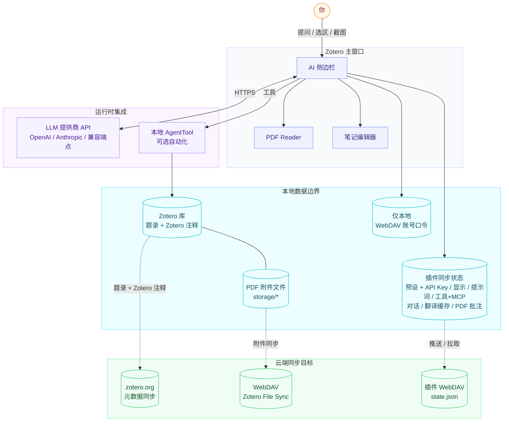
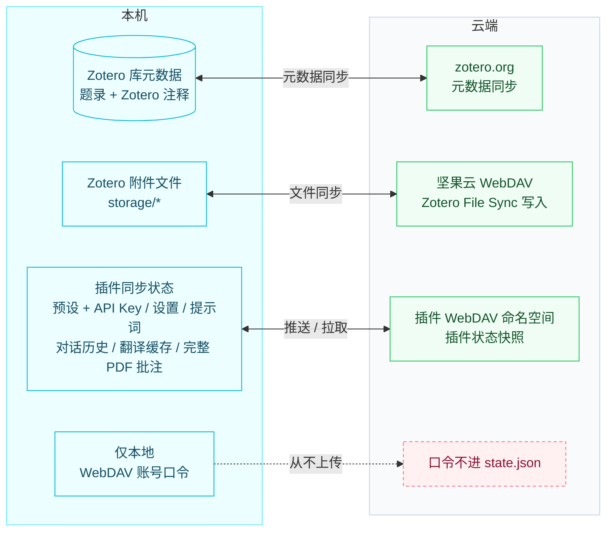

# Zotero AI Sidebar

[English](README.md) | [中文](README.zh-CN.md)

一个住在 Zotero 里的 AI 论文助手。对正在读的论文问任何问题，侧边栏会自己读 PDF（或者 arXiv 论文的 LaTeX 源），展示推理过程，并把答案写回笔记。

> 👀 **[图解使用教程 →](https://xuhan-rgb.github.io/zotero-ai-sidebar/quick-start.html)**（纯 HTML 1:1 还原真实界面：界面总览 · 配置模型 · 对话 · 沉浸式翻译 · 笔记与总览 · 快捷键）

📖 [完整使用指南](docs/USAGE.zh-CN.md) ([English](docs/USAGE.md)) —— 上手、常用场景、功能手册、故障排查。

## 能做什么

- **对正在读的论文随便问** —— *"帮我总结"*、*"核心贡献是什么"*、*"和 X 比较"*。模型自动取它需要的 PDF 内容，并在工具 trace 里把过程显式展示。
- **arXiv 论文公式不破** —— 公式和插图从 LaTeX 源码取，不再是 PDF 文本层里的乱码。*"解释 Eq. (3)"* 和 *"讲一下 Figure 2"* 都能精确命中。
- **PDF 沉浸式翻译** —— 开启沉浸模式后点句子即在原文旁出译文卡；`Enter` / `Shift+Enter` 在句子间穿行，`/` 把光标移进追问框，`Esc` 关卡后该句仍标为「在读高亮」可继续切句。
- **写回 Zotero** —— 把回答追加到论文笔记，或者让模型给 PDF 加按颜色分类的高亮（按预设的权限模式开关）。
- **想用什么模型用什么** —— Anthropic、OpenAI 或任意 OpenAI 兼容端点，全部在 Zotero 偏好里本地配置。
- **本地优先，同步目标由你掌握** —— 不开同步时数据不出本机；开启 WebDAV 同步后，会把单个 `state.json` 推送到*你自己的*端点。它包含设置、模型预设（含 API key）、聊天历史、PDF 批注和翻译缓存——不会发给 zotero.org 或任何第三方。

## 安装

1. 从 [GitHub Releases](https://github.com/xuhan-rgb/zotero-ai-sidebar/releases/latest) 下载最新的 `zotero-ai-sidebar.xpi`。
2. 打开 Zotero 7、8 或 9。
3. 进入 `工具` → `插件`。
4. 点击齿轮图标，选择 `从文件安装插件…`。
5. 选择刚下载的 `.xpi` 文件，按提示重启 Zotero。

当前仓库只发布 `.xpi` 文件。简化后的发布流程不再发布 Zotero 自动更新清单（`update.json` / `update-beta.json`）。

## 配置

在 Zotero 中打开 AI Sidebar 设置，至少配置一个模型预设：

- 提供商：`anthropic` 或 `openai`
- API Key：保存在本地 Zotero 偏好中
- Base URL：官方端点或任何 OpenAI 兼容端点
- 模型：该端点支持的任意模型 ID
- Max tokens / 工具循环上限：本地的安全与输出长度控制

PDF 沉浸式翻译可在插件设置的“翻译 / 沉浸阅读”两块里调整：

- 模型 / 思考程度 / 结果位置（句上、句下）/ 翻译框大小：与沉浸卡共用
- 结合上下句：翻译时带上前后各一句作上下文，更准
- 重点词对应：译文里高亮原文 ↔ 中文的关键词对，悬停互相点亮
- 切句快捷键（默认 `Enter` / `Shift+Enter`）、选区快捷翻译键（默认空格）、聚焦追问键（默认 `/`）、收起工具栏键（默认 `h`）均可改

请勿在本仓库中硬编码个人 API Key、Base URL 或私有模型 ID。

## 功能特性

### 对话与界面

- **Zotero 内置 AI 对话**：直接在专属侧边栏与当前论文对话，无需离开 Zotero。
- **多提供商可配置**：通过 Zotero 本地偏好支持 Anthropic、OpenAI 以及任何 OpenAI 兼容端点。账号预设支持连通性测试，可为每个预设配置独立的模型列表并通过底部切换器快速切换。
- **快捷提示词与 Slash 命令**：在输入框旁边可自定义提示词按钮，并内置 `/arxiv-search`、`/web-search` 等 slash 命令，这些命令会被展开成给模型的明确指令。
- **Markdown 输出**：渲染标题、列表、代码块、引用、链接、思考/上下文块，以及工具调用轨迹。
- **选区上下文条**：PDF 有选中文本时，输入框上方会显示下一轮是 `只看选区` 还是 `选区 + 全文`，并提供本轮全文覆盖和选区预览。
- **可定制聊天界面**：用户和 AI 的昵称、头像（emoji 或图片 URL）均可自定义，每条消息的操作按钮位置和布局也可配置。
- **干净 / 调试两种复制模式**：将对话以 Markdown 复制时，普通导出包含论文介绍、对话和当轮 PDF 选区；调试模式额外附带工具上下文、PDF 片段、模型输入顺序和思考过程。

### 全文总览

- **整篇论文一眼看清的「全文总览」**：在对话与 Reader 之间的中间列里，给出核心摘要叙述、按阶段（动机 / 方法 / 验证）分组的章节骨架（每节一句话主旨、`创新` / `效果锚点` 强调）、可折叠的子章节，以及一张折叠的结构流程图。通过模型工具循环按需生成（`zotero_outline_pdf` → `render_paper_overview`），不会自动整篇上传 PDF。
- **点击跳转 + 吸顶头部**：点击章节即跳到 PDF 对应位置（优先用 PDF 自带目录，精确滚到章节顶部；没有目录时回退到文本匹配）。头部带 ↶ 返回栈、↩ 回到`在读`、以及 🔒 锁定（锁定后可浏览其它章节而不移动在读锚点）。
- **导出与保存**：可用 `↗ 浏览器` 把总览作为独立 HTML 在系统浏览器打开；生成时还会自动作为子 HTML 附件保存到条目上，随 Zotero 自身同步。
- **记住并同步阅读位置**：每篇论文的`在读`锚点跨重启保留，并随 `state.json` 同步。
- 注意：章节跳转依赖 PDF 目录 / 文本匹配（无 SyncTeX），对于不在 PDF 自带目录里的章节，落点可能是近似位置。

### PDF 与论文研究工具

- **由模型驱动的 Zotero 工具**：使用 Codex 风格的工具循环；不靠本地关键词/正则的意图判定来决定该把哪些 PDF 内容塞给模型。
- **PDF 上下文工具**：当前条目元信息、批注、PDF 全文检索、PDF 区间阅读、PDF 全文阅读，以及划选文本作为上下文。
- **选区原文溯源**：选中的 PDF 原文会保留在对话气泡和 Markdown 导出中；当 Zotero 提供定位信息时，可一键跳回 PDF 原选区。
- **图像上下文**：可以附带截图或图片，让模型分析图表、界面状态或 PDF 截图。工具栏截图按钮在 Linux 和 Windows 上都能截取 Reader 区域。
- **可自定义注释颜色规则**：可编辑模型写入 PDF 注释时使用的自然语言色彩规则，默认把 Zotero 的六种预设 hex 颜色映射到论文阅读常用类别（背景、问题、方法、数据集、结果等）。
- **arXiv 论文工具**：内置 `paper_search_arxiv` 和 `paper_fetch_arxiv_fulltext`，模型可按需检索 arXiv 并抓取全文。

### 笔记

- **统一的笔记列导航**：一个分段切换器（笔记 · 路线 · 总览）在 AI 笔记、阅读路线、全文总览之间切换——切换只导航、绝不触发生成。可生成的视图在为空时显示居中的「生成」按钮、生成后在头部显示 `↻ 更新`，路线与总览行为一致。笔记视图的 `⋯` 菜单里有「对话总结」，把沉浸阅读的就地问答汇总进笔记，并原地替换旧的总结而非堆叠重复。
- **面板内笔记编辑器**：在对话旁打开笔记列，直接就地编辑 Zotero 的富文本笔记，并提供 assistant 写入笔记的工具。
- **模型主动写入笔记**：模型也可以自行调用 `zotero_append_to_note`，把助手输出追加到当前条目的子笔记中，没有子笔记时会自动创建。
- **按当前光标导入片段**：选中一段助手回答后右键 `导入笔记`，会优先插入到当前 Zotero 笔记光标处，而不是固定追加到末尾。
- **稳定恢复笔记位置**：写入笔记后会恢复原来的滚动位置 / 鼠标锚点 / 光标位置，避免跳回笔记最开头。
- **返回 PDF 原选区**：写入笔记的块和助手上下文标签会带 `查看原选区` 跳转，方便从笔记或对话回到触发回答的 PDF 原文。

### 翻译

- **PDF 沉浸式翻译**：在 PDF Reader 工具栏开启 `沉浸`，点句子即在原文旁出译文卡（原文 + 译，最省 token）；卡内可切换「逐句对照」（一行英文一行中文）、「重点词对应」、「结合上下句」、「自适应宽度」，底部还能继续「追问」让 AI 解释 / 举例。
- **保存与复用译文**：可把译文卡的翻译保存为 Zotero 高亮批注（💾）；若该句已有批注，卡片会直接显示已存的笔记而不重新翻译，保存时按 key upsert，不会产生重复高亮。沉浸模式开启时会隐藏 Zotero 原生选区菜单，让译文卡成为唯一交互面。
- **切句、选区快译与追问**：`Enter` / `Shift+Enter` 翻到下一句 / 上一句；选中（或悬停）某句后按快捷键（默认空格）直接翻这一句；按 `/` 把光标移进卡底「追问」框（Enter 已用于切句）；`Esc` 关掉卡片后该句仍标为「在读高亮」，可继续切句；按收起工具栏键（默认 `h`）可把卡片的信息栏和底栏折叠到只剩输入框。快捷键都可在设置里改。

### 同步与配置

- **配置备份与恢复**：把模型预设（含 API key）、显示设置、快捷提示词、联网/MCP 设置和翻译设置打包为一个 JSON 文件，可导出 / 导入，方便换机迁移。该文件含密钥，请妥善保管、不要公开分享。
- **WebDAV 云同步**：通过单个 `state.json` 快照在任意 WebDAV 端点（如坚果云）推送 / 拉取——包含模型预设（含 API key）、显示设置、快捷提示词、联网/MCP 设置、翻译设置、AI 对话历史、逐句翻译缓存、完整 PDF 批注（高亮 / 下划线 / 笔记 / 墨迹）、逐条目全文总览，以及阅读位置（`在读`锚点）。
- **自动同步**：默认关闭；开启后启动时和每 10 分钟先从云端下载，合并本地对话 / 缓存数据，再上传合并后的状态。
- **非破坏式对话同步**：云端有、本地没有的对话消息会追加进来；本地已有的对话不会被下载操作删除。
- **由你掌控的敏感信息**：API Key、Base URL、模型 ID 保存在 Zotero 偏好里，绝不硬编码进源码，也绝不发给 zotero.org / 插件作者 / 任何第三方。但它们*会*随你自己的 `state.json`（WebDAV 同步）和配置导出文件一起走——这两者都是你掌控的私有文件，请像对待任何含凭据的文件一样保管。WebDAV 账号口令本身不会写进快照。

## 总体架构



### 三层云同步分工



## 开发

安装依赖：

```bash
npm install
```

运行测试：

```bash
npm test
```

本地构建 XPI：

```bash
npm run build
```

构建产物在 `.scaffold/build/`。本地 `.xpi` 文件已被 `.gitignore` 忽略，不要提交。

### 代码结构

Zotero 面板侧边栏入口是 `src/modules/sidebar.ts`，它保留核心对话编排（面板渲染、send/stream、reader 选区、笔记窗口编排），并把聚焦的职责拆到同级模块——`sidebar-state`（共享状态/类型）、`reader-access` → `pdf-navigation` → `note-pdf-render`（reader / PDF 跳转 / 引用子系统），以及 `pdf-geometry`、`client-rect-geometry`、`message-scroll`、`selected-text-format`、`prompt-cache-debug`、`reading-route-note`、`overview-attachment` 等。完整文件地图见 [`CLAUDE.md`](CLAUDE.md) 里的 **Code Reference Map**。

## 发布

`/auto-commit` 完成版本号更新后，运行 `npm run release:xpi` 即可一步完成打 tag、推送、GitHub Actions 构建并发布 Release。`--republish`、显式 tag 等参数及校验细节见 [`docs/RELEASE.md`](docs/RELEASE.md)。

## 设计原则

项目特定的修改指引（Codex 风格 agent、Claudian 风格对话 UI、Better Notes 风格笔记编辑、不可触碰的红线）都在 [`CLAUDE.md`](CLAUDE.md)。本地工具 / Web Search / MCP 的使用边界见 [`docs/TOOLS_AND_MCP.md`](docs/TOOLS_AND_MCP.md)。

## 许可证

AGPL-3.0-or-later。
